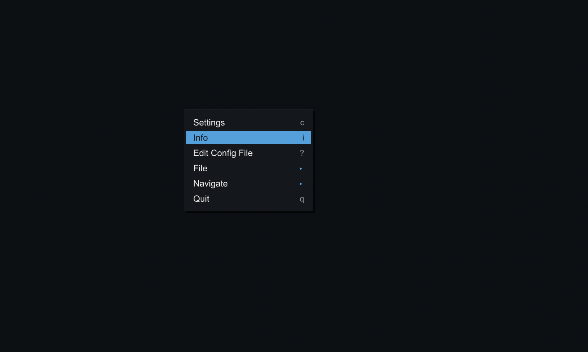

# Encore

**A graphical settings editor and feature suite for vanilla [mpv](https://mpv.io) — pure Lua, no dependencies.**

Inspired by [mpv.net](https://github.com/stax76/mpv.net): Encore brings a
mpv.net-style GUI experience to plain mpv, the way an encore continues the show.

No .NET, no fork, no external dependencies — just drop a folder into your mpv
config directory. Everything runs through mpv's built-in scripting API, so mpv
updates can't break it and it works on Windows, Linux, and macOS.


The headline feature is a **graphical settings editor** in the style of
mpv.net's config editor: a category tree, per-setting controls, a live
help/description panel, and type-anywhere search — drawn as an in-player OSD
menu, so it needs no GUI toolkit.



A themed, cursor-positioned **right-click context menu** defined from your
`input.conf`, plus info dialogs, session memory, and more.

## Features

| Script | What it does |
|--------|--------------|
| **encore-settings** | Graphical settings editor — 152 settings in a category tree, live search, live-apply, comment-preserving writes to `mpv.conf`, full scrollable help for every option |
| **encore-menu** | Right-click context menu built from `#menu:` comments in `input.conf`; opens at the cursor, cascading submenus, mouse + keyboard |
| **encore-info** | Info dialogs: media info, commands, key bindings, protocols, decoders, demuxers, profiles, about |
| **encore-files** | File operations via native dialogs (Windows): open files, load subtitle/audio, open from clipboard, DVD/Blu-ray |
| **encore-playback** | Auto-load the rest of a folder into the playlist; recent-files menu |
| **encore-session** | Remember volume and audio device across sessions |
| **encore-window** | Content-aware initial window size for images and audio |
| **encore-edit** | Open `mpv.conf` / `input.conf` / `encore.conf` in your text editor |

Several mpv.net features are already built into modern mpv (`select.lua`):
playlist / track / audio-device selectors, command palette, properties viewer.
The bundled `input.conf` wires keys to those too.

## Requirements

- **mpv 0.39 or newer** (uses the `mp.input` module). Tested on mpv 0.41.

## Install

Copy `scripts/` and `script-modules/` into your mpv config directory, and merge
`input.conf` into your own:

| OS | Config directory |
|----|------------------|
| Windows | `%APPDATA%\mpv\` |
| Linux / macOS | `~/.config/mpv/` |

So you end up with e.g. `~/.config/mpv/scripts/encore-settings/`,
`~/.config/mpv/script-modules/`, and your merged `~/.config/mpv/input.conf`.

Restart mpv. Press the keys below (or edit `input.conf` to taste).

## Default key bindings

From the bundled `input.conf` (edit freely):

| Key | Action |
|-----|--------|
| `c` | Open the settings editor |
| right-click | Context menu |
| `i` | Info dialogs |
| `o` | Open files (native dialog) |
| `Ctrl+v` | Open path/URL from clipboard |
| `Ctrl+r` | Recent files |
| `F1` | Command palette · `Ctrl+p` playlist · `p` properties |
| `?` | Edit a config file |

### Settings editor controls

`↑↓` move · `Enter` edit / expand · `→` into a category's settings · `←`/`Esc`
back · type anywhere to search all settings · mouse wheel or `Shift+↑↓` to scroll
a long description.

## Configuration (mpv.net options)

Seven mpv.net-specific options are implemented by the feature scripts and stored
in `encore.conf` — set them from the settings editor (General / Window sections),
or by hand:

```ini
# encore.conf
remember-volume=yes
remember-audio-device=yes
auto-load-folder=yes
recent-count=15
autofit-image=80
autofit-audio=70
menu-syntax=#menu:
```

## Optional: native settings window (Windows)

A native Win32 settings window (same idea, real OS window) is included as an
**optional** alternative in [`gui/`](gui/) — build it with `gui/build.bat`
(Visual Studio). It is not used by default; the cross-platform OSD editor above
is the standard UI. See [`gui/README.md`](gui/README.md).

## Not included / limitations

A few mpv.net features can't be done from a script and were left out:

- **Native file-open dialogs** work on **Windows only** (they shell out to
  PowerShell); elsewhere, use mpv's drag-and-drop or `loadfile`.
- mpv.net options with no script equivalent (custom window chrome / dark title
  bar, system-wide global hotkeys, single-instance, remembering window position)
  are **not** reproduced, and have been removed from the settings list so it only
  shows options that actually do something.

## Tests

`tests/test_logic.lua` exercises the settings parser and the comment-preserving
config round-trip in mpv's own Lua runtime:

```
mpv --no-config --idle=once --script=tests/test_logic.lua
```

## Credits & license

Encore is inspired by and indebted to **[mpv.net](https://github.com/stax76/mpv.net)**
by **stax76**, who sadly passed away. mpv.net showed how friendly mpv could be on
the desktop; Encore is a small attempt to keep that spirit going for everyone on
vanilla mpv. It is an independent project and is **not** affiliated with mpv.net —
please don't confuse the two.

The setting definitions in `scripts/encore-settings/editor_conf.txt` are derived
from mpv.net, and the folder-loading logic adapts mpv's `autoload.lua`. Both
[mpv.net](https://github.com/stax76/mpv.net) and [mpv](https://github.com/mpv-player/mpv)
are GPL-licensed.

Licensed under the **GNU General Public License v2** — see [LICENSE](LICENSE).
