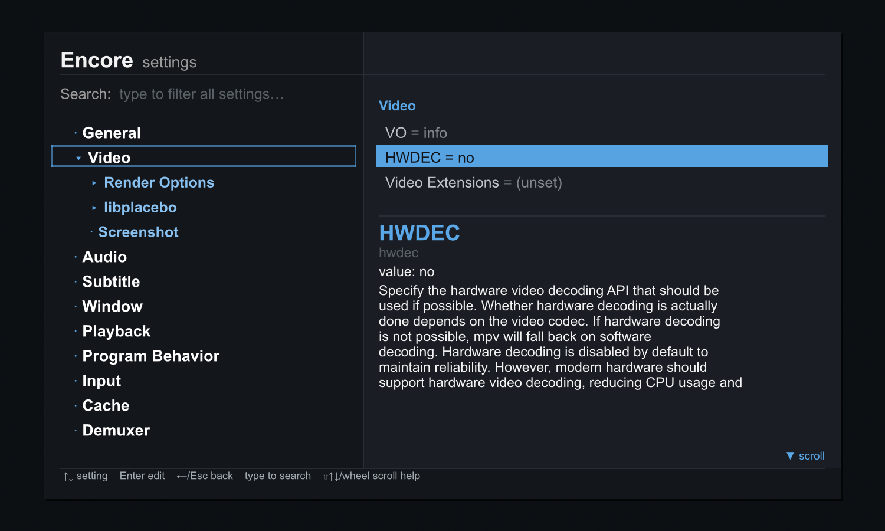

# Encore

**A graphical settings editor and feature suite for vanilla [mpv](https://mpv.io) — pure Lua, no dependencies.**

Inspired by [mpv.net](https://github.com/stax76/mpv.net): Encore brings a
mpv.net-style GUI experience to plain mpv, the way an encore continues the show.

No .NET, no fork, no external dependencies — just drop a folder into your mpv
config directory. Everything runs through mpv's built-in scripting API, so mpv
updates can't break it and it works on Windows, Linux, and macOS.



The headline feature is a **graphical settings editor** in the style of
mpv.net's config editor: a category tree, per-setting controls, a live
help/description panel, and type-anywhere search — drawn as an in-player OSD
menu, so it needs no GUI toolkit.

A **native right-click context menu** — mpv's own built-in menu, defined in
`menu.conf` and drawn by the OS — exposes every feature, so Encore ships no key
bindings of its own.

## Features

| Script | What it does |
|--------|--------------|
| **encore-settings** | Graphical settings editor — 146 settings in a category tree, live search, live-apply, comment-preserving writes to `mpv.conf`, full scrollable help for every option; keyboard **and mouse** driven |
| **encore-files** | File operations via native dialogs (Windows): open files, load subtitle/audio, open from clipboard, DVD/Blu-ray |

Most of what mpv.net offered is now built into modern mpv, so Encore leans on it
rather than reimplementing it. The bundled `menu.conf` wires these native
features into the right-click menu:

- **Context menu, info & statistics, config editing** — `select.lua` / `stats.lua`
  (`select/context-menu`, `stats/display-stats`, `select/edit-config-file`).
- **Playlist / track / audio-device / chapter selectors, command palette,
  properties viewer, recent files (watch history)** — `select.lua`.
- **Auto-load a folder as a playlist** — `--autocreate-playlist`.
- **Content-aware window sizing** — `--autofit` / `--geometry`.
- **Remember volume across sessions** — `--save-position-on-quit`.

## Requirements

- **mpv 0.39 or newer** (uses the `mp.input` module). Tested on mpv 0.41.

## Install

Copy `scripts/`, `script-modules/`, and `menu.conf` into your mpv config
directory:

| OS | Config directory |
|----|------------------|
| Windows | `%APPDATA%\mpv\` |
| Linux / macOS | `~/.config/mpv/` |

So you end up with e.g. `~/.config/mpv/scripts/encore-settings/`,
`~/.config/mpv/script-modules/`, and `~/.config/mpv/menu.conf`.

Restart mpv, then **right-click** for the menu. Encore ships no `input.conf` —
every feature is in the menu, and mpv's built-in defaults already bind
right-click, `i`/`I` (info & statistics), `?` (key bindings), and friends. Want
shortcut keys? Add your own, e.g. `c script-binding encore_settings/open`.

## Settings editor

Open it from **right-click → Settings** (or bind a key to
`script-binding encore_settings/open`).

`↑↓` move · `Enter` edit / expand · `→` into a category's settings · `←`/`Esc`
back · type anywhere to search all settings · `Shift+↑↓` or wheel to scroll a
long description. **Mouse:** hover to highlight, click a category to expand,
click a setting to edit, click outside to close.

## Optional: native settings window (Windows)

A native Win32 settings window (same idea, real OS window) is included as an
**optional** alternative in [`gui/`](gui/) — build it with `gui/build.bat`
(Visual Studio). It is not used by default; the cross-platform OSD editor above
is the standard UI. See [`gui/README.md`](gui/README.md).

## Not included / limitations

A few mpv.net features can't be done from a script and were left out:

- **Native file-open dialogs** work on **Windows only** (they shell out to
  PowerShell); elsewhere, use mpv's drag-and-drop or `loadfile`.
- mpv.net options with no script equivalent (custom window chrome / dark title
  bar, system-wide global hotkeys, single-instance, remembering window position)
  are **not** reproduced, and have been removed from the settings list so it only
  shows options that actually do something.

## Tests

`tests/test_logic.lua` exercises the settings parser and the comment-preserving
config round-trip in mpv's own Lua runtime:

```
mpv --no-config --idle=once --script=tests/test_logic.lua
```

## Credits & license

Encore is inspired by and indebted to **[mpv.net](https://github.com/stax76/mpv.net)**
by **stax76**, who sadly passed away. mpv.net showed how friendly mpv could be on
the desktop; Encore is a small attempt to keep that spirit going for everyone on
vanilla mpv. It is an independent project and is **not** affiliated with mpv.net —
please don't confuse the two.

The setting definitions in `scripts/encore-settings/editor_conf.txt` are derived
from mpv.net. Both
[mpv.net](https://github.com/stax76/mpv.net) and [mpv](https://github.com/mpv-player/mpv)
are GPL-licensed.

The bundled `menu.conf` (the native context-menu layout) is adapted from
[**Samillion/mpv-conf**](https://github.com/Samillion/mpv-conf)'s `menu.conf` —
its vanilla-mpv command structure is reused, with the modernz/sponsorblock
entries dropped and Encore's own actions wired in. With thanks to Samillion.

Licensed under the **GNU General Public License v2** — see [LICENSE](LICENSE).
